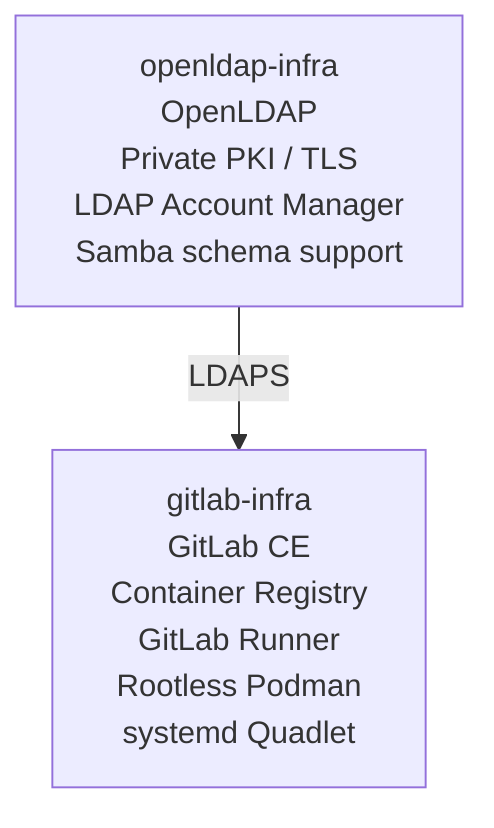
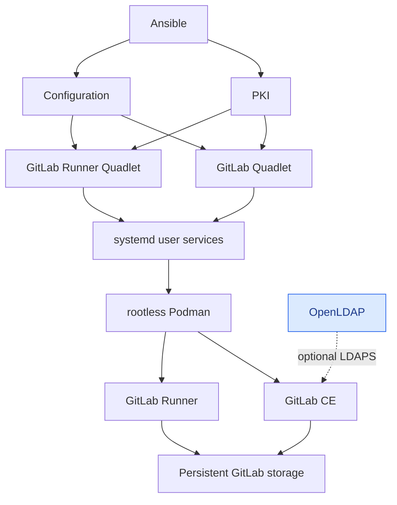

# GitLab Infrastructure

Ansible-based infrastructure for deploying a self-hosted **GitLab CE and
GitLab Runner platform** with **rootless Podman** and **systemd Quadlet**.

[](https://github.com/embtom/gitlab-infra/actions/workflows/ci.yml)
[](https://github.com/embtom/gitlab-infra/releases)

GitLab provides source control, package and container registries, CI execution,
TLS, and the automation required to operate the platform as reproducible
infrastructure.

## Features

- **GitLab CE** with persistent configuration, logs, data, package registry,
  container registry, HTTPS, and SSH repository access
- **Rootless GitLab Runner** with configurable concurrency, job networking,
  image pull policy, and custom CA trust
- **systemd Quadlet** for container lifecycle management
- **Private PKI** with a root CA, intermediate CA, and GitLab TLS certificate
- **Ansible automation** for provisioning, configuration, deployment, and
  validation
- **GHCR images** for reproducible runner deployments
- **Local builds** for offline environments and custom runner images
- **LDAP integration** with group-based GitLab access
- **Persistent host storage** separated from the containers
- **User provisioning** and administrator promotion
- **Backup and restore** documentation
- **Versioned releases** with semantic container image tags

## Related Infrastructure

This repository provides the GitLab and CI layer of the
[embtom infrastructure](https://github.com/embtom).

For centralized identity and LDAP services, see
[`embtom/openldap-infra`](https://github.com/embtom/openldap-infra).



Both projects use the same infrastructure principles:

- Ansible-managed deployment
- rootless Podman
- systemd Quadlet
- private PKI and TLS
- persistent host-managed storage
- versioned container images
- reproducible deployment workflows

## Architecture



Ansible connects from the control machine to configure the Linux host and
create the required users, directories, certificates, and Quadlet units.
systemd starts and supervises GitLab and GitLab Runner as rootless Podman
services under the `gitlab` and `gitlab-runner` service users. The runner
registers with GitLab and launches CI jobs from the configured job image through
its rootless Podman socket. GitLab and Runner data is stored in host directories,
separate from their containers. The private root and intermediate CA keys remain
on the control machine; only the GitLab server key, certificate, and runner trust
certificate are deployed to the host.

## Prerequisites

- Linux target with Podman and systemd user services enabled
- A user account configured for rootless Podman
- systemd --user available for that user
- Python 3 and `pipx` on the control machine
- Remote deployments require a working OpenSSH configuration so
  `ssh <remote-host>` succeeds
- Privilege escalation is required for host-level configuration on remote
  targets
- A GitLab Runner registration token for the first runner deployment

## Quick Start

Install the required dependencies:

```bash
./scripts/install-requirements
./scripts/install-ansible
```

Create the local configuration and encrypted Ansible Vault:

```bash
./scripts/configure-gitlab.py
```

Deploy locally:

```bash
./scripts/deploy.py --host localhost
```

Or deploy to a remote host:

```bash
./scripts/deploy.py --host <remote-host>
```

After deployment, GitLab is available on the configured external host. The
default web port is `8081` and the container registry is available on port
`5050`.

For a first-time runner deployment:

```bash
./scripts/deploy.py --host localhost --tags runner
```

The deployment prompts for the runner registration token when required.

## Install Dependencies

```bash
./scripts/install-requirements
./scripts/install-ansible
```

The install scripts install the Python requirements, Ansible, `ansible-lint`, `yamllint`, and the required Ansible collections.

## Configuration

Create local configuration and an encrypted Ansible Vault for secrets:

```bash
./scripts/configure-gitlab.py
```

The configurator asks whether GitLab LDAP authentication is enabled. When it
is enabled, it asks for the LDAP certificate hostname. For an OpenLDAP service
on the same host, it configures Podman's dynamic `host-gateway` mapping, so no
DHCP address is stored and the hostname remains valid for TLS. For a remote
LDAP service, standard DNS resolution is used. The LDAP bind password is stored
in the vault. Otherwise, GitLab is deployed without LDAP authentication. The
generated files are local and ignored by Git.

Set deployment-specific values as inventory variables in
`ansible/inventories/hosts.yml`, or provide them from a separate Ansible
variable file. The role defaults are documented in
`ansible/roles/gitlab_service/defaults/main.yml`,
`ansible/roles/gitlab_runner/defaults/main.yml`, and
`ansible/roles/pki/defaults/main.yml`.

Common settings include:

```yaml
gitlab_service_external_host: gitlab.example.internal
gitlab_service_image: docker.io/gitlab/gitlab-ce:19.3.1-ce.0
gitlab_service_web_port: 8081
gitlab_service_ssh_port: 2223
gitlab_service_registry_port: 5050
gitlab_service_data_dir: /srv/gitlab/data

gitlab_runner_container_method: image-pull
gitlab_runner_image_pull_image: ghcr.io/embtom/gitlab-infra/gitlab-runner:latest
gitlab_runner_image_pull_job_image: ghcr.io/embtom/gitlab-infra/gitlab-runner-image:latest
gitlab_runner_request_concurrency: 2
```

For production deployments, use a release-tagged runner image instead of
`latest`. Set `gitlab_runner_container_method: direct-build` to build and
transfer both runner images from the control machine instead of pulling them
from GHCR.

## Deploy GitLab

Deploy locally:

```bash
./scripts/deploy.py --host localhost
```

Deploy to the remote GitLab machine:

```bash
./scripts/deploy.py --host <remote-host>
```

Recreate the GitLab data directories before deployment:

```bash
./scripts/deploy.py --host localhost --recreate true
```

> **Warning:** Recreating the data directories is destructive. Use it only
> when intentionally starting with fresh GitLab data.

Ansible uses privilege escalation for host-level configuration and directory
setup. GitLab and GitLab Runner themselves run as rootless Podman services
under their configured service users. GitLab, including its package registry,
is available at the configured external host on port `8081` by default. The
container registry is enabled by default at `https://<external-host>:5050`.

The role manages separate host directories for GitLab configuration, logs, and
persistent data. By default these are `/var/lib/gitlab/config`,
`/var/lib/gitlab/logs`, and `/var/lib/gitlab/data`; override
`gitlab_service_config_dir`, `gitlab_service_logs_dir`, or
`gitlab_service_data_dir` in inventory to place them on different filesystems.

The default service deployment also creates the local PKI required for GitLab
TLS. To generate or renew only the PKI material, run:

```bash
./scripts/deploy.py --host localhost --tags pki
```

## TLS and PKI

The default deployment creates the private PKI required for GitLab TLS. Generate
or renew only the PKI material with:

```bash
./scripts/deploy.py --host localhost --tags pki
```

### PKI Locations

The root CA, intermediate CA, and GitLab server certificate are generated on
the Ansible control machine, not on the managed host. GitLab shares this PKI
with the other embtom infrastructure services. By default, all source material
is stored beneath:

```text
~/.local/share/embtom/pki/
```

Private CA keys remain on the control machine.

GitLab's controller-side artifacts use the name `<hostname>-gitlab`, for
example `jupiter-gitlab.key` and `jupiter-gitlab-fullchain.crt`. During GitLab
deployment, the managed host receives the key and full certificate chain in
`/var/lib/gitlab/config/ssl/` by default:

```text
<hostname>-gitlab.key            # GitLab server private key
<hostname>-gitlab-fullchain.crt  # GitLab server certificate followed by the intermediate CA
```

When the runner role is deployed, it also receives the root CA certificate at
`/var/lib/gitlab-runner/config/certs/root-ca.crt`. Override these locations
with the corresponding `pki_*`, `gitlab_service_*`, or `gitlab_runner_*`
variables.

## GitLab LDAP Authentication

GitLab can authenticate users against the OpenLDAP infrastructure provided by
[`embtom/openldap-infra`](https://github.com/embtom/openldap-infra).

LDAP authentication is optional and disabled by default. The OpenLDAP
integration can restrict GitLab access to members of a dedicated LDAP group
using the `memberOf` attribute.

The LDAP bind password is stored in Ansible Vault and is never passed as a
command-line argument. For the complete LDAP deployment and group
configuration, see the
[`openldap-infra` documentation](https://github.com/embtom/openldap-infra).

## Deploy GitLab Runner

Deploy the runner role separately:

```bash
./scripts/deploy.py --host localhost --tags runner
```

The first deployment requests a GitLab Runner registration token. Set runner
configuration in inventory or a variable file. By default, the role pulls the
prebuilt images published by this repository:

```yaml
gitlab_runner_container_method: image-pull
gitlab_runner_image_pull_image: ghcr.io/embtom/gitlab-infra/gitlab-runner:latest
gitlab_runner_image_pull_job_image: ghcr.io/embtom/gitlab-infra/gitlab-runner-image:latest
```

Use a release tag instead of `latest` to pin the deployed images. For an
offline build or local image customization, switch to `direct-build`; the
control machine builds both images and transfers them to the target:

```yaml
gitlab_runner_container_method: direct-build
gitlab_runner_version: "19.2.2"
```

The runner service image, job image, GitLab URL, request concurrency, and
Podman pull policy can also be overridden with the `gitlab_runner_*` variables
in `ansible/roles/gitlab_runner/defaults/main.yml`.

## Provision Users

Provision a regular user:

```bash
./scripts/deploy.py --host localhost \
  --provision-user alice \
  --provision-email alice@example.com \
  --provision-password 'choose-a-strong-password'
```

Provision an administrator:

```bash
./scripts/deploy.py --host localhost \
  --provision-user alice \
  --provision-email alice@example.com \
  --provision-password 'choose-a-strong-password' \
  --provision-admin
```

`--provision-admin` is a flag and takes no value. User provisioning is
idempotent: existing users are not modified.

Promote an existing user, including an LDAP user who has logged in once, to an
administrator:

```bash
./scripts/deploy.py --host localhost --make-admin alice
```

This command only updates an existing GitLab account and does not require or
change its password.

Avoid entering production passwords directly into shared shell history. The VS
Code provisioning tasks use a masked password prompt and pass the password
without shell interpretation.

## Helper Commands

Operational helpers and recovery procedures are documented separately:

- [GitLab helper commands](doku/gitlab-helper-commands.md)
- [GitLab backup and restore](doku/gitlab-backup.md)

## Container Images And Releases

Pull requests build both runner images as a verification step. Pushes to
`main` publish the `latest` images to GHCR:

- `ghcr.io/embtom/gitlab-infra/gitlab-runner:latest`
- `ghcr.io/embtom/gitlab-infra/gitlab-runner-image:latest`

Run the **Release** GitHub Actions workflow manually from the default branch to
create a versioned release. The release workflow reads the newest semantic
version from `CHANGELOG.md`, promotes both `latest` images to that version, and
creates the matching GitHub release. Update `CHANGELOG.md` before starting the
release workflow. For deployments where reproducibility matters, prefer an
explicit release tag over `latest`.

## Validation

```bash
./scripts/ansible-lint
```

## VS Code Tasks

The workspace provides tasks for:

- installing dependencies
- linting Ansible
- configuring GitLab and PKI
- deploying GitLab and the GitLab Runner
- provisioning regular users and new administrators
- promoting an existing user, including an LDAP user, to administrator

Run them from **Command Palette -> Tasks: Run Task**.

## Storage and Recovery

GitLab configuration, logs, and application data are stored outside the
containers so that container replacement does not remove persistent state.

Before destructive operations, ensure that GitLab backups and the required
persistent directories are available. See [GitLab backup and restore](doku/gitlab-backup.md)
and [GitLab helper commands](doku/gitlab-helper-commands.md). The deployment
can recreate service containers without recreating persistent GitLab data.

## Design Goals

The project intentionally uses:

- **rootless containers** instead of a rootful container runtime
- **systemd Quadlet** instead of an additional container orchestration layer
- **Ansible** for reproducible host configuration
- **host-managed persistent storage** instead of container-local state
- **private PKI** instead of disabling TLS verification
- **versioned images** for reproducible deployments

The goal is a small, transparent GitLab platform that integrates cleanly with
standard Linux system administration rather than introducing another
infrastructure layer.
